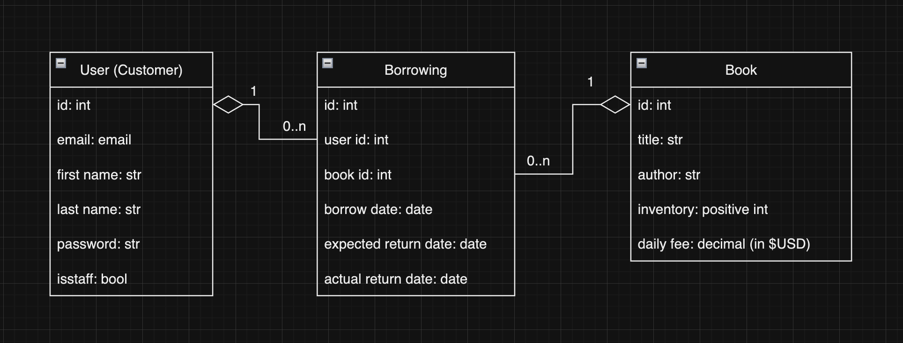
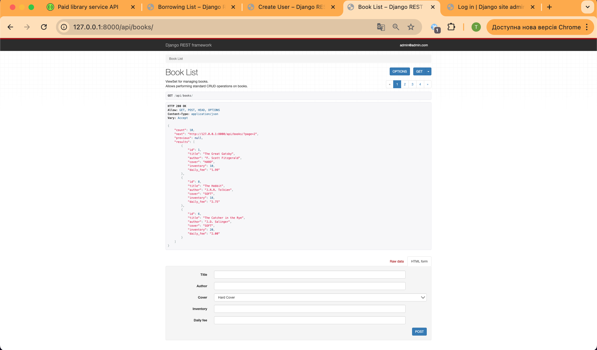
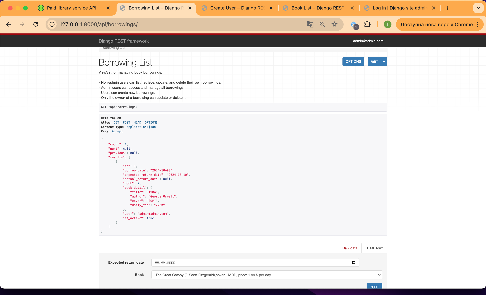
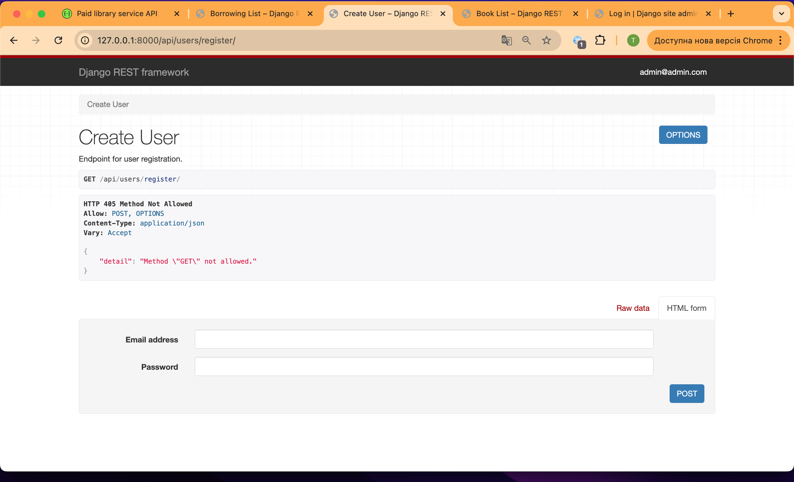
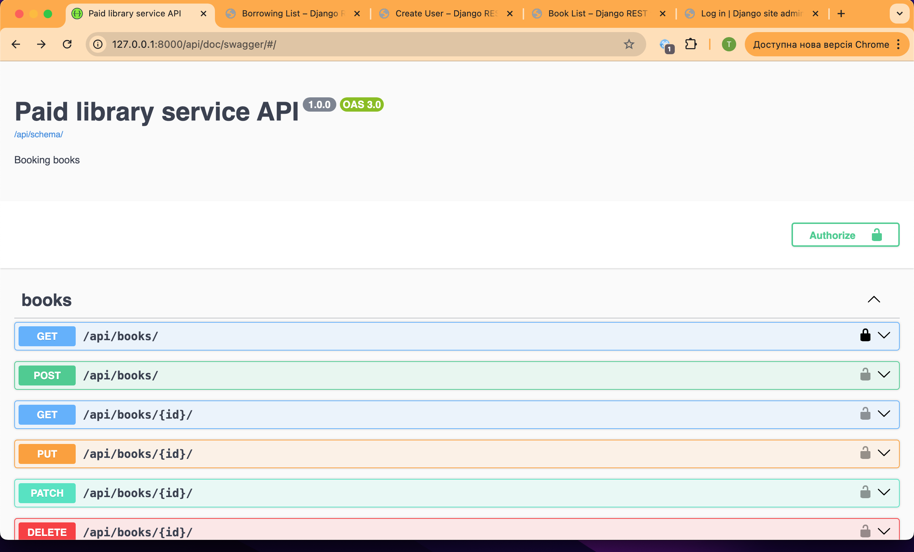
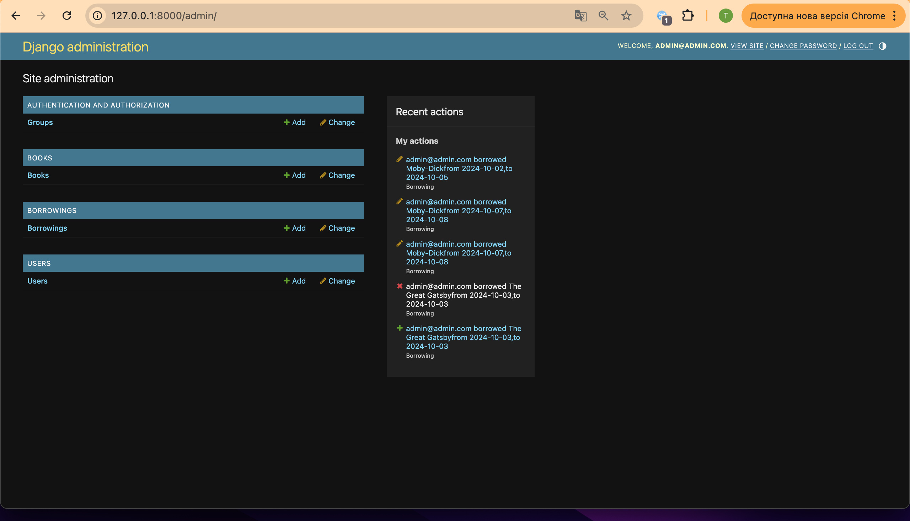

# paid-library-service
An online management system for library book borrowings and payments.

### This is an API service written on DRF, that allows you to management:
- books ,
- borrowings,
- users,

with different user permissions.

## DB Structure




## Installing / Getting started

### Python3 must be already installed

## Installing using GitHub


```bash
git clone https://github.com/TarasFirst/paid-library-service.git
cd paid-library-service
python -m venv venv
source venv/bin/activate
pip install -r requirements.txt
```

## Create .env file and replace all "value" for your own values:

```plaintext
POSTGRES_PASSWORD=value
POSTGRES_USER=value
POSTGRES_DB=value
POSTGRES_HOST=value
POSTGRES_PORT=5432
PGDATA=/var/lib/postgresql/data
SECRET_KEY="value"
ACCESS="private_access"
```

## Run with Docker

Docker should be installed

```bash
docker-compose build
docker-compose up
docker-compose exec paid_library_service python manage.py createsuperuser
```
### Set email as the name and set password to superuser


```bash
docker-compose exec paid_library_service python manage.py loaddata data_books.json
```

## Getting Access

## Via namespace `/api/users/`

- `token/`
- `token/refresh/`
- `token/verify/`
- `register/`
- `me/`


## Added Features

- Admin panel `/api/admin/`
- Documentation `/api/doc/swagger/` and `/api/doc/redoc/`


## Via namespace `api/books/`

- Creat, change and remove books;
- Filtering books by title and by author.


## Via namespace `api/borrowings/`

- Creat, change and remove borrowings;
- Managing borrowings of only the owner or admin;
- Filtering of borrowings by user id for admin only.


### Some pages












# Project structure
```plaintext
paid-library-service/
├── .gitignore
├── README.md
├── manage.py
├── requirements.txt
├── .dockerignore
├── Dockerfile
├── docker-compose.yaml
├── main.py
├── .env
├── paid_library_service/
│   ├── __init__.py
│   ├── asgi.py
│   ├── settings.py
│   ├── urls.py
│   └── wsgi.py
├── books/
│   ├── __init__.py
│   ├── admin.py
│   ├── apps.py
│   ├── models.py
│   ├── serializers.py
│   ├── views.py
│   ├── urls.py
│   ├── tests/
│   │   ├── __init__.py
│   │   ├── test_book_model.py
│   │   ├── test_book_viewset.py
│   │   └── test_book_serializers.py
│   ├── migrations/
│   │   ├── __init__.py
│   │   └── 0001_initial.py
│   ├── management/
│   │   ├── commands/
│   │   │   ├── __init__.py
│   │   │   ├── wait_for_db.py
│   │   ├── __init__.py
├── users/
│   ├── __init__.py
│   ├── admin.py
│   ├── apps.py
│   ├── models.py
│   ├── serializers.py
│   ├── views.py
│   ├── urls.py
│   ├── tests/
│   │   ├── __init__.py
│   │   ├── test_models.py
│   │   ├── test_views.py
│   │   ├── test_serializers.py
│   ├── migrations/
│   │   ├── __init__.py
│   │   └── 0001_initial.py
├── borrowings/
│   ├── __init__.py
│   ├── admin.py
│   ├── apps.py
│   ├── models.py
│   ├── serializers.py
│   ├── views.py
│   ├── urls.py
│   ├── tests/
│   │   ├── __init__.py
│   │   ├── test_borrowing_models.py
│   │   ├── test_borrowing_viewset.py
│   │   ├── test_borrowing_serializers.py
│   ├── migrations/
│   │   ├── __init__.py
│   │   └── 0001_initial.py
└── media/
```

